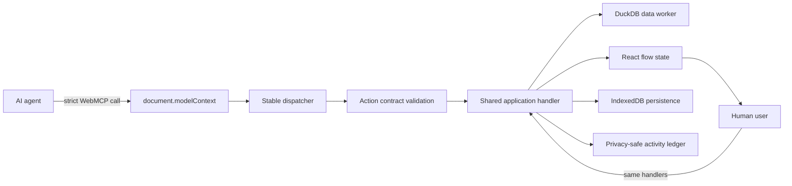

# TabulaFlow WebMCP architecture

TabulaFlow exposes the same Source → Prepare → Compose workflow to people and AI agents. WebMCP is a semantic application API, not a list of simulated clicks.

Contract version: `3.3.0`

## Design goals

1. Give agents structured access to real product operations.
2. Keep the UI and agent on one visible, persistent flow state.
3. Reject stale, duplicated, unsafe, or over-broad mutations.
4. Keep raw sensitive values out of agent responses.
5. Reserve permission, destructive confirmation, and interpretation boundaries for people.

## Runtime architecture



The browser registers tools through `document.modelContext.registerTool()`. Unsupported browsers continue with the normal human-operated product.

## Stable tool surface

TabulaFlow registers 17 stable tools for the lifetime of the page.

### Core tools

- `tabulaflow_get_workspace_state`
- `tabulaflow_get_capabilities`
- `tabulaflow_get_workflow_guide`
- `tabulaflow_get_available_actions`
- `tabulaflow_get_activity_log`
- `tabulaflow_get_changes_since`
- `tabulaflow_get_operation_status`
- `tabulaflow_cancel_operation`
- `tabulaflow_get_pending_confirmations`
- `tabulaflow_reject_confirmation`
- `tabulaflow_open_workspace`

### Workspace dispatchers

- `tabulaflow_source`
- `tabulaflow_prepare_read`
- `tabulaflow_prepare_mutate`
- `tabulaflow_compose_read`
- `tabulaflow_compose_mutate`
- `tabulaflow_qualitative_coding`

Five Source, Prepare, and Compose dispatchers expose 60 action routes:

| Dispatcher | Action routes | Responsibility |
| --- | ---: | --- |
| Source | 10 | Local selection, agent upload, cloud files, reset request |
| Prepare read | 9 | Dataset, profile, recipe, preview, semantics, metrics |
| Prepare mutate | 20 | Recipes, filters, formulas, semantics, metrics, export |
| Compose read | 10 | Graph, node, schema, preview, quality, validation |
| Compose mutate | 11 | Create, update, arrange, move, promote, export, delete request |

`tabulaflow_qualitative_coding` is a separate bounded dispatcher. It accepts coding suggestions but does not expose human approval as an agent action.

## Contract discovery

An agent discovers the strict schema for one action before calling it:

```json
{
  "action": "get_action_contract",
  "input": {
    "action": "create_compose_operation"
  }
}
```

The dispatcher returns the current action-specific JSON Schema. Schemas reject undeclared properties with `additionalProperties: false`.

The agent then calls the same dispatcher with the target action and validated input:

```json
{
  "action": "create_compose_operation",
  "input": {
    "operation": {
      "kind": "aggregate",
      "inputId": "prepared-orders",
      "groupBy": ["service"],
      "metrics": [
        { "function": "count", "alias": "shipment_count" }
      ]
    },
    "expectedRevision": 12,
    "requestId": "demo-create-aggregate-001",
    "executionMode": "wait"
  }
}
```

IDs and revisions in examples are illustrative. Agents must read the current workspace state immediately before a mutation.

## Mutation lifecycle

Every data mutation targets a stable `preparedId` or `nodeId` and includes:

- `expectedRevision` to reject stale state;
- a unique `requestId` for flow-scoped idempotency;
- an optional execution mode for accepted asynchronous work.

Long-running mutations use this lifecycle:

```text
accepted → running → committing → succeeded | failed
accepted | running → cancelling → cancelled
```

An idempotent replay returns the same operation and artifact. Cancellation before commit does not advance the workspace revision.

## Data exposure

Prepare and Compose previews require 1–20 explicit columns and return at most 20 rows. Sensitive cells are redacted.

Sensitive frequency groups return opaque `valueRef` tokens. Agents may preserve or apply those references without learning the raw value. Recipe reads similarly protect sensitive formula, filter, and replacement literals.

Schema deltas return compact counts by default. Wide details use byte-bounded cursor pages.

## Human-control boundaries

| Boundary | Agent capability | Human authority |
| --- | --- | --- |
| Local file | Focus the chooser | Select or re-link the file |
| Agent-workspace file | Request a short-lived upload | Allow uploads for the flow session |
| Cloud file | List/open signed-in files | Sign in and choose cloud uploads |
| Delete/reset | Open a pending confirmation | Confirm or reject visibly |
| Semantic declassification | Request a change | Approve lowering sensitivity |
| Qualitative coding | Submit evidence-backed suggestions | Own codebook and accept assignments |

## Agent-workspace upload

Large file bytes do not pass through the WebMCP tool payload.

1. The agent calls `begin_agent_upload` with file metadata, size, and SHA-256.
2. TabulaFlow asks for visible session consent when needed.
3. The application returns a short-lived HTTP upload capability.
4. The agent sends the exact bytes with HTTP `PUT`.
5. The worker verifies size, digest, extension, and basic file signature.
6. The agent calls `commit_agent_upload` with revision and idempotency metadata.
7. TabulaFlow imports the file through the same transactional DuckDB path as the UI.
8. Staged bytes are deleted after consumption, cancellation, or expiry.

The upload limit is 50 MB. A session expires after 15 minutes and is rate-limited per requester.

## Shared activity

User and agent mutations append to one flow-scoped ledger. Events contain actor, origin, action, stable target, status, revision, and safe operational metadata. They never contain preview rows, raw cell values, local paths, upload tokens, or mutation payloads.

## Implementation map

| Concern | Primary implementation |
| --- | --- |
| Tool registration and schemas | `src/useWebMcpTools.js` |
| Runtime health and registration budget | `src/webMcpRuntime.js` |
| Revision, idempotency, async, cancellation | `src/webMcpMutation.js` |
| Interaction and confirmation lifecycle | `src/webMcpInteractions.js` |
| Privacy sanitization | `src/webMcpPrivacy.js`, `src/agentDataProtection.js` |
| Shared application actions | `src/App.jsx` |
| Temporary upload transport | `src/agentUploads.js`, `worker/index.js` |
| Data execution | `src/data.worker.js`, `src/composeSql.js` |

## Verification

The repository tests registration budget, schema closure, handler routing, protected-value round trips, source interaction lifecycle, revision conflicts, idempotent replay, cancellation, privacy redaction, upload integrity, and Sites packaging.

Run all gates with:

```bash
npm test
npm run build
npm run test:sites
```
